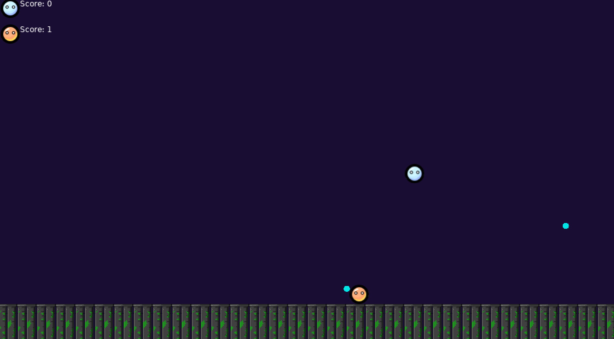

# HookShot

This game was made at the Hackers at Cambridge 2018 Game Gig using the [Love2D](https://love2d.org/) framework. All images and code were created by me and are licensed here under the terms of the GNU GPL v3 or later (see the [LICENSE](LICENSE)) for more.

The sound effect and music were obtained from [https://freesound.org/](https://freesound.org/), and their license are to be found [here](music/background.license) and [here](music/lasershot.license).

# How to Play

This is two player game, where each player controls one button.

- Player 1 uses `Ctrl`

- Player 2 uses `Return`

You want to hit the other player with your spinning orb while it's yellow.

