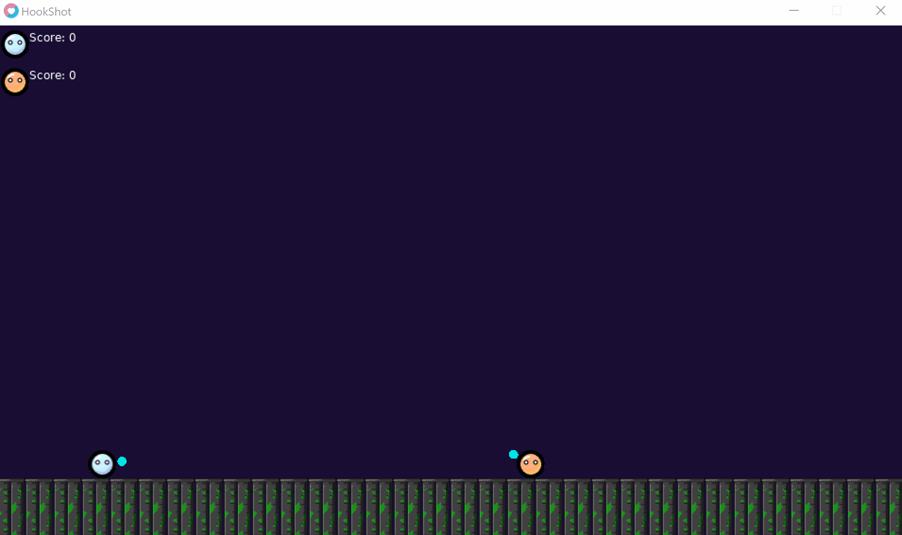

# HookShot




## Download

  - [Windows Executable](https://github.com/moosichu/HookShot/releases/download/1.0.0/HookShot-Windows.zip)
  - [.love package](https://github.com/moosichu/HookShot/releases/download/1.0.0/HookShot.love)

## Licensing

This game was made at the Hackers at Cambridge 2018 Game Gig using the [Love2D](https://love2d.org/) framework. All images and code were created by me and are licensed here under the terms of the GNU GPL v3 or later (see the [LICENSE](LICENSE)) for more.

The sound effect and music were obtained from [https://freesound.org/](https://freesound.org/), and their license are to be found [here](music/background.license) and [here](music/lasershot.license).

Love2D is a framework for making games, which was licensed under the following license:
```
Copyright © 2006-2016 LÖVE Development Team

This software is provided 'as-is', without any express or implied warranty. In no event will the authors be held liable for any damages arising from the use of this software.

Permission is granted to anyone to use this software for any purpose, including commercial applications, and to alter it and redistribute it freely, subject to the following restrictions:

    The origin of this software must not be misrepresented; you must not claim that you wrote the original software. If you use this software in a product, an acknowledgment in the product documentation would be appreciated but is not required.
    Altered source versions must be plainly marked as such, and must not be misrepresented as being the original software.
    This notice may not be removed or altered from any source distribution.
```

## How to Play

This is two player game, where each player controls one button.

- Player 1 uses `Ctrl`

- Player 2 uses `Return`

You want to hit the other player with your spinning orb while it's yellow.
